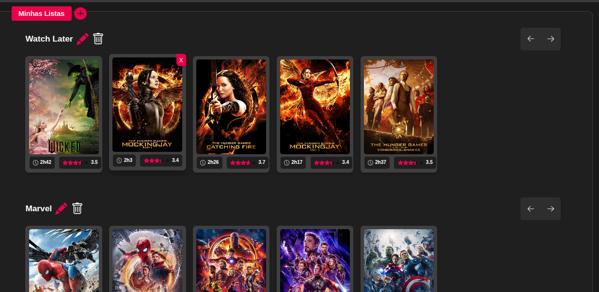
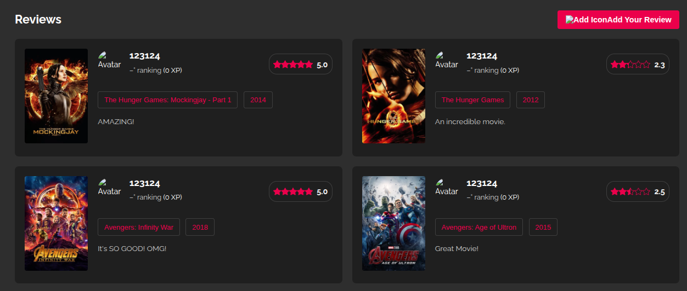

# Lumiere Project

[**Lumiere**](https://henrik-g69.github.io/Lumiere/index.html) is a web application that recommends movies based on the user's preferences. By analyzing selected films, it suggests new titles that match the user's tastes. It **connects to the OMDB API** to fetch real-time data such as posters, genres, ratings, and other **comprehensive details**, enhancing the **user experience (UX)** to be dynamic, personalized, and interactive.

Built primarily with **HTML, CSS, and JavaScript**, Lumiere incorporates a **robust caching system** that significantly **reduces API calls (by 30%)** and makes the website highly **optimized**, leading to a **10% reduction in loading times**. This ensures a fluid and efficient content discovery experience.

## SCREENSHOTS ##

**Home**

**Films & Series**

 

**Filmes && Series View**

 

**Lists**

**Reviews**

**Search Bar**
 

**Sign Up**

**Login**

## Link ##
You can check it out [**here**](https://henrik-g69.github.io/Lumiere/index.html)
